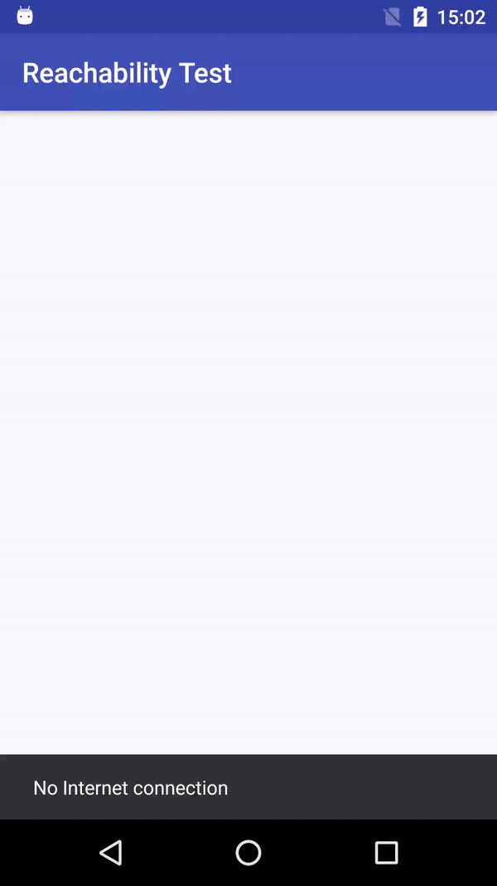

# Reachability

Simple network status tracker for Android.



## Usage

Get a Reachability instance:

```kotlin
    mReachability = Reachability.getInstance(view.getContext())
```

Add an observer for reachability status changes:

```kotlin
    mReachability.addListener(object : ReachabilityStateObserver {
        override fun onReachabilityStateChange(newState: Reachability.State) {
                
        }
    })
```

or simply implement `ReachabilityStateObserver` to your class:

```kotlin
    class YourClass : ReachabilityStateObserver {}
```

and add `this` as a listener:

```kotlin
    mReachability.addListener(this)
```

You should use `startNotifier()` method for start listening of Network state changes:

```kotlin
    mReachability.startNotifier()
```

When you don't need to listen changes, you can use `stopNotifier()` method:

```kotlin
    mReachability.stopNotifier()
```

Please, don't forget to remove your observer with `removeListener()` method if it's not needed anymore:
```kotlin
    mReachability.removeListener(this)
```

##### Also, you can see an usage example [here][2].

## Installation

Maven:
```xml
<dependency>
  <groupId>ua.eshcherbinock</groupId>
  <artifactId>reachability</artifactId>
  <version>0.0.6</version>
  <type>pom</type>
</dependency>
```

Gradle:
```groovy
implementation 'ua.eshcherbinock:reachability:0.0.6'
```

You can see the latest version number [here][1] or download library directly.

## Contributing

1. Fork it - https://github.com/Eugene-Shcherbinock/Reachability/fork
2. Create your feature(fix) branch
`git checkout -b some-feature`
3. Commit your changes 
`git commit -m 'add some feature'`
4. Push to the branch
`git push origin my-new-feature`

5. Create new Pull Request [here][3]

##### I will be glad of your interest and participation :)

## License
-------

    Copyright 2018 Eugene Shcherbinock

    Licensed under the Apache License, Version 2.0 (the "License");
    you may not use this file except in compliance with the License.
    You may obtain a copy of the License at

       http://www.apache.org/licenses/LICENSE-2.0

    Unless required by applicable law or agreed to in writing, software
    distributed under the License is distributed on an "AS IS" BASIS,
    WITHOUT WARRANTIES OR CONDITIONS OF ANY KIND, either express or implied.
    See the License for the specific language governing permissions and
    limitations under the License.
    
   
[1]: https://bintray.com/eugene-shcherbinock/maven/Reachability
[2]: https://github.com/Eugene-Shcherbinock/Reachability/tree/master/app/src/main/java/ua/eshcherbinock/reachabilitytest
[3]: https://github.com/Eugene-Shcherbinock/Reachability/pulls
